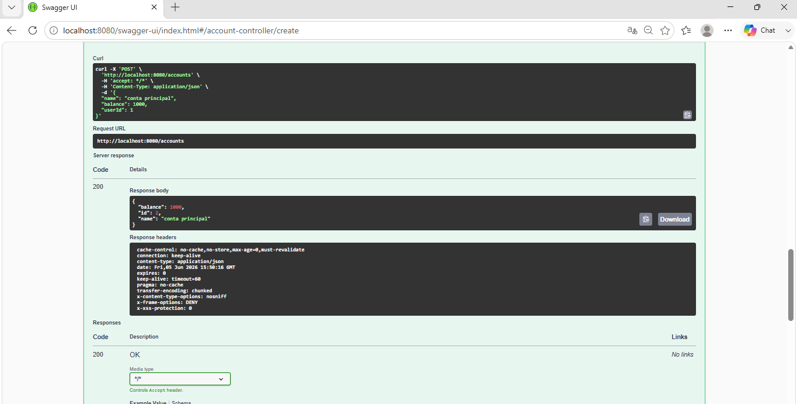
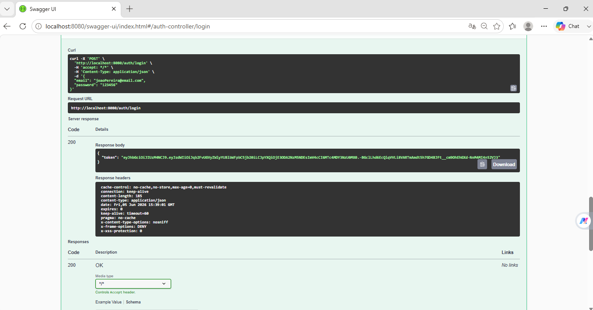
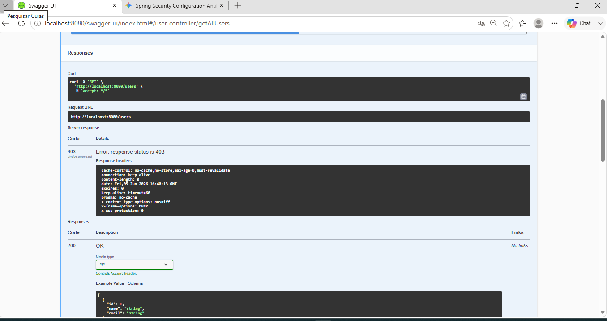
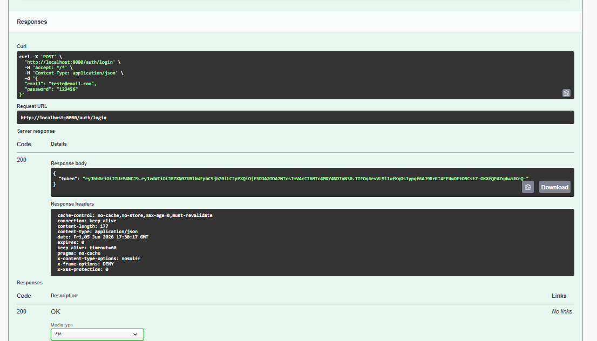
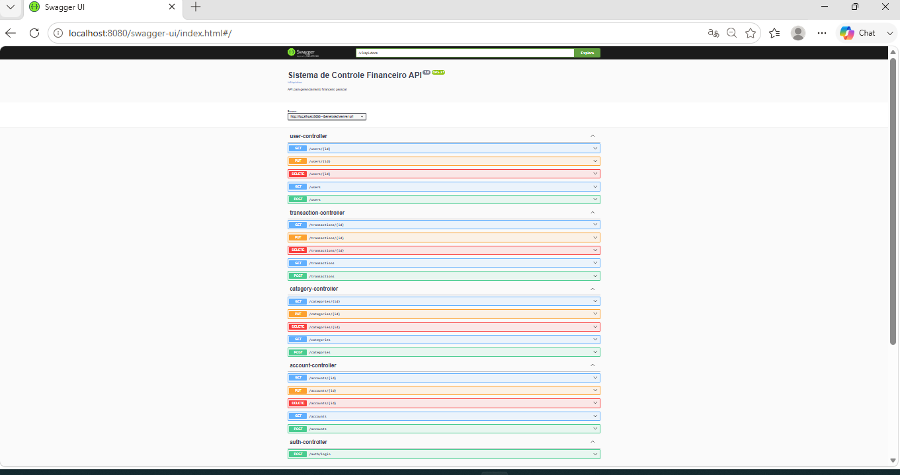
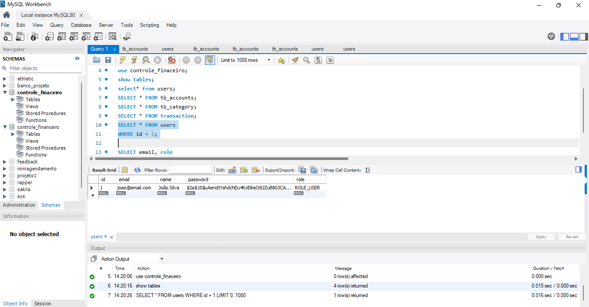

# Sistema de Controle Financeiro

API REST desenvolvida com Java e Spring Boot para gerenciamento financeiro pessoal, permitindo cadastro de usuários, autenticação segura com JWT e gerenciamento de contas financeiras.

---

## Tecnologias Utilizadas

- Java 21
- Spring Boot
- Spring Data JPA
- Spring Security
- JWT (JSON Web Token)
- MySQL
- Maven
- Swagger / OpenAPI
- Git
- GitHub

---

## Funcionalidades

### Usuários
- Cadastro de usuários
- Consulta de usuários
- Atualização de usuários
- Exclusão de usuários

### Contas
- Cadastro de contas
- Consulta de contas
- Atualização de contas
- Exclusão de contas

### Segurança
- Autenticação com JWT
- Senhas criptografadas com BCrypt
- Endpoints públicos e protegidos
- Controle de acesso por token

---

## Arquitetura do Projeto

O projeto segue uma arquitetura em camadas:

```text
Controller
    ↓
Service
    ↓
Repository
    ↓
Banco de Dados
```

Também foram aplicadas boas práticas como:

- DTOs para entrada e saída de dados
- Tratamento global de exceções
- Separação de responsabilidades
- Spring Security para autenticação
- JWT para autorização

---

## Estrutura do Projeto

```text
src/main/java
├── config
├── controller
├── dto
├── entity
├── exceptions
├── repository
├── security
└── service
```

---

## Endpoints Principais

### Endpoints Públicos

#### Cadastro de Usuário

```http
POST /users
```

#### Login

```http
POST /auth/login
```

### Endpoints Protegidos

#### Usuários

```http
GET /users
GET /users/{id}
PUT /users/{id}
DELETE /users/{id}
```

#### Contas

```http
POST /accounts
GET /accounts
GET /accounts/{id}
PUT /accounts/{id}
DELETE /accounts/{id}
```

---

## Exemplo de Cadastro

### Request

```json
{
  "name": "João Silva",
  "email": "joao@email.com",
  "password": "123456"
}
```

### Response

```json
{
  "id": 1,
  "name": "João Silva",
  "email": "joao@email.com"
}
```

---

## Exemplo de Login

### Request

```json
{
  "email": "joao@email.com",
  "password": "123456"
}
```

### Response

```json
{
  "token": "SEU_TOKEN_JWT"
}
```

---

## Autenticação

Para acessar os endpoints protegidos, envie o token JWT no Header da requisição:

```http
Authorization: Bearer SEU_TOKEN_JWT
```

---

## Tratamento de Exceções

O sistema possui tratamento global de exceções utilizando:


Exemplos:

- Usuário não encontrado
- Conta não encontrada
- Requisições inválidas
- Erros de autenticação

---

# Screenshots

## Cadastro de Usuário

> Inserir print aqui



---

## Login e Geração de Token

> Inserir print aqui



---

## Acesso Negado Sem Token

> Inserir print aqui



---

## Acesso Permitido Com Token

> Inserir print aqui



---

## Swagger / OpenAPI

> Inserir print aqui



---

## Banco de Dados MySQL

> Inserir print aqui



---

## Próximas Melhorias

- Docker
- Frontend Web
- Deploy em Nuvem
- Categorias Financeiras
- Transações Financeiras
- Dashboard Financeiro

---

## Autor

**Junior Rodrigues**

Desenvolvedor Back-end com foco em:

- Java
- Spring Boot
- APIs REST
- Spring Security
- JWT
- MySQL

---

## Status do Projeto

🚧 Em desenvolvimento

Etapas concluídas:

- CRUD de Usuários
- CRUD de Contas
- DTOs
- Tratamento Global de Exceções
- Spring Security
- JWT Authentication
- Swagger
- Testes dos Endpoints

Próxima etapa:

- Dockerização da aplicação
